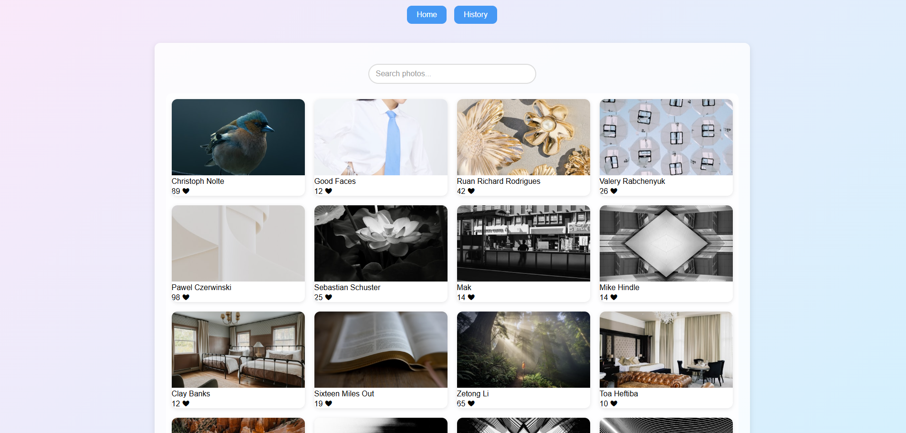
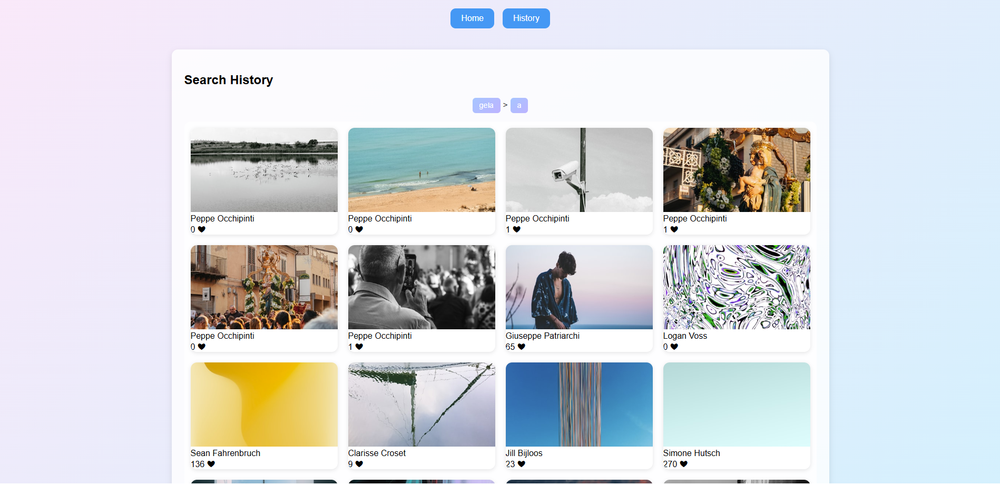
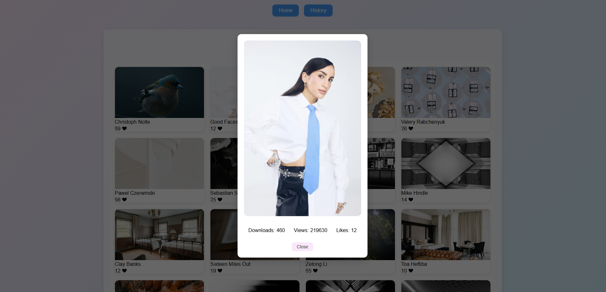

# React Unsplash Gallery

A **photo gallery application** built with React that allows you to browse the 20 most popular images from Unsplash, search for images, view your search history, and see image statistics in a modal. Features **infinite scroll**, **caching**, and a modern gradient design.

---

## Screenshots

### Home Page



### History Page



### Image Modal



---

## Features

- Display the 20 most popular images on the home page
- Search images by keywords (no search button needed)
- Caching: previously searched terms are stored and loaded instantly
- View search history and click a term to reload its images
- Infinite scroll on both Home and History pages
- Click on an image to view full version with downloads, views, and likes
- Responsive design with light pink and light blue gradient backgrounds

---

## Getting Started

### Prerequisites

- Node.js and npm installed on your machine
- Unsplash API Access Key

#### How to get Unsplash Access Key

1. Sign up at [Unsplash Developers](https://unsplash.com/developers)
2. Create a new application to get your **Access Key**
3. Create a `.env` file in the project root:

```env
REACT_APP_UNSPLASH_ACCESS_KEY=your_access_key_here
```
